This is my Home Assistant Configuration for my smart home. Feel free to look around. Hope it can be helpful for those learning or wondering how to improve their own Home Assistant like I did in the beginning. Poking around others setups was really helpful to me in the start.

Follow along here: 

Did this help? 🍕 <a href="https://www.buymeacoffee.com/rwarner">Feel free to buy me a piece of za</a> 🍕

## Current Server Hardware

  
 - [Intel Core i5-6400 2.7 GHz Quad-Core Processor](https://amzn.to/3C0RaOq)
 - [Jetway NF594-Q170 Mini-ITX Motherboard](https://www.jetwaycomputer.com/NF594.html)
 - [Timetec 16GB SODIMM Ram](https://amzn.to/4gEnCWg)
 - [Kingston 1TB mSata SSD](https://amzn.to/43lcWaI)
 - [InWin RF100S-S265 (1U Server Case)](https://amzn.to/4iVfqCk)

<h2>Community Plugins Used</h2>

<h3>🧩 Integrations</h3>
<table>
  <thead>
    <tr>
      <th>Plugin</th>
      <th>Description</th>
    </tr>
  </thead>
  <tbody>
    <tr>
      <td>HACS</td>
      <td>Powerful UI to handle downloads of all your custom needs.</td>
    </tr>
    <tr>
      <td>Adaptive Lighting</td>
      <td>Adaptive Lighting custom component for Home Assistant.</td>
    </tr>
    <tr>
      <td>WebRTC Camera</td>
      <td>Real-time viewing of almost any camera stream using WebRTC.</td>
    </tr>
    <tr>
      <td>Alexa Media Player</td>
      <td>Control Amazon Alexa devices using the unofficial Alexa API.</td>
    </tr>
    <tr>
      <td>Alarmo</td>
      <td>Easy-to-use alarm system integration.</td>
    </tr>
    <tr>
      <td>fontawesome</td>
      <td>Use icons from FontAwesome in Home Assistant.</td>
    </tr>
    <tr>
      <td>Variables+History</td>
      <td>Variables component for Home Assistant with history support.</td>
    </tr>
  </tbody>
</table>

<h3>🖼️ Dashboards (Lovelace UI)</h3>
<table>
  <thead>
    <tr>
      <th>Plugin</th>
      <th>Description</th>
    </tr>
  </thead>
  <tbody>
    <tr>
      <td>Mushroom</td>
      <td>Build a beautiful Home Assistant dashboard easily.</td>
    </tr>
    <tr>
      <td>mini-graph-card</td>
      <td>Minimalistic graph card for Lovelace UI.</td>
    </tr>
    <tr>
      <td>button-card</td>
      <td>❇️ Lovelace button card for flexible controls.</td>
    </tr>
    <tr>
      <td>Mini Media Player</td>
      <td>Minimalistic media card for Lovelace UI.</td>
    </tr>
    <tr>
      <td>auto-entities</td>
      <td>🔹 Automatically populate entities list in Lovelace cards.</td>
    </tr>
    <tr>
      <td>card-mod</td>
      <td>🔹 Add CSS styles to (almost) any Lovelace card.</td>
    </tr>
    <tr>
      <td>fold-entity-row</td>
      <td>🔹 A foldable row for entities card.</td>
    </tr>
    <tr>
      <td>Kiosk Mode</td>
      <td>🙈 Hides the Home Assistant header and/or sidebar.</td>
    </tr>
    <tr>
      <td>card-tools</td>
      <td>🔹 Collection of tools for other Lovelace plugins.</td>
    </tr>
    <tr>
      <td>bignumber-card</td>
      <td>A large-format number display card.</td>
    </tr>
  </tbody>
</table>

## <a name="SmartHomeEquipment">Smart Home Equipment</a>

[Networking](#Networking) | [Smart Home Hubs](#SmartHomeHubs) | [Zigbee](#Zigbee) | [Z-Wave](#ZWave) | [Lighting](#Lighting) | [Cameras / Security](#Cameras) | [Media Devices](#MediaDevices) | [Amazon Alexa](#AmazonAlexa) | [Miscellaneous](#Misc)

 As an Amazon Associate I earn from qualifying purchases, in links below for convenience.

### <a name="Networking">Networking</a>

> [Back To Top](#SmartHomeEquipment)

<table border="0">
 
   <tr>
      <th align=center colspan="2">
         Device
      </th>
      <th align=center>
         Notes
      </th>
   </tr>
 
   <tr>
      <td align=center>
         <a href="https://amzn.to/3ZUNGoI">Unifi AP U6 LR</a>
      </td>
      <td align=center>
         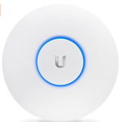
      </td>
      <td colspan="2">
         2x Standard Unifi Access Point, WiFi 6 version
      </td>
   </tr>

   <tr>
      <td align=center>
         <a href="https://amzn.to/3bQe0Jd">Unifi AP U6-IW</a>
      </td>
      <td align=center>
         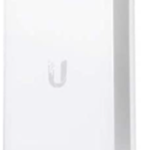
      </td>
      <td colspan="2">
         2x Unifi Access Point for putting "in the wall" or moreso on a outlet cover
      </td>
   </tr>

   <tr>
      <td align=center>
         <a href="https://amzn.to/40brcBf">Unifi US 24 PoE 250W Switch</a>
      </td>
      <td align=center>
         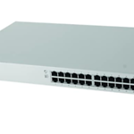
      </td>
      <td colspan="2">
         Unifi's standard rack mountable switch 250w POE. Connecting most equipment in the server rack.
      </td>
   </tr>

   <tr>
      <td align=center>
         <a href="https://amzn.to/38R3qQd">Unifi US-8-60W Switch</a>
      </td>
      <td align=center>
         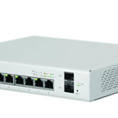
      </td>
      <td colspan="2">
         Smaller POE switch
      </td>
   </tr>

   <tr>
      <td align=center>
         <a href="https://amzn.to/3sHlnc6">Unifi Flex Mini</a>
      </td>
      <td align=center>
         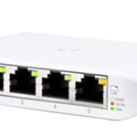
      </td>
      <td colspan="2">
         Unifi Switch used for my Office. Powered by POE!
      </td>
   </tr>
 
   <tr>
      <td align=center>
         <a href="https://amzn.to/41TIRi1">Unifi UDM Pro</a>
      </td>
      <td align=center>
         
      </td>
      <td colspan="2">
         Router for incoming ISP, also running Unifi Network / Unifi Protect software for home network. Also provides information to Home Assistant of device tracking.
      </td>
   </tr>

 </table>

<!----------------- NEW SECTION ------------------>
### <a name="SmartHomeHubs">Smart Home Hubs</a>

> [Back To Top](#SmartHomeEquipment)

<table border="0">
 
   <tr>
      <th align=center colspan="2">
         Device
      </th>
      <th align=center>
         Notes
      </th>
   </tr>

   <tr>
      <td align=center>
         <a href="https://amzn.to/3sFd2FV">GoControl HUSBZB-1</a> (Zigbee / Z-Wave)
      </td>
      <td align=center>
         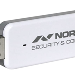
      </td>
      <td colspan="2">
         Moved over to this for all direct Home Assistant Zigbee / Z-Wave needs. Everything is much faster and reliable now than using two seperate hubs outside of HA. I also favored to only use the Hue bulbs through this device through Alexa so everything is in one place.
      </td>
   </tr>

   <tr>
      <td align=center>
         <a href="https://amzn.to/38RTciF">Logitech Harmony Hub</a>
      </td>
      <td align=center>
         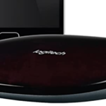
      </td>
      <td colspan="2">
         Used to control most of the Home Theater equipment via IR. Used prior to any smart home stuff. Now connected thrugh Home Assistant / Alexa to start movie viewing. "Alexa turn on Projector"
      </td>
   </tr>
 
</table>

<!----------------- NEW SECTION ------------------>
### <a name="Zigbee">Zigbee</a>

> [Back To Top](#SmartHomeEquipment)

<table border="0">
 
   <tr>
      <th align=center colspan="2">
         Device
      </th>
      <th align=center>
         Notes
      </th>
   </tr>

   <tr>
      <td align=center>
         <a href="https://amzn.to/3bIg06l">Hue Bulbs</a>
      </td>
      <td align=center>
         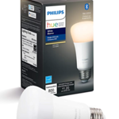
      </td>
      <td colspan="2">
         Hue Bulbs connected through Home Assistant's Zigbee connection. If anything, they help also provide the Zigbee network extend reach throughout the property.
      </td>
   </tr>
   
   
   <tr>
      <td align=center>
         <a href="https://www.samsung.com/us/smart-home/smartthings/buttons/samsung-smartthings-button-gp-u999sjvleaa/">Smart Things Button</a>
      </td>
      <td align=center>
         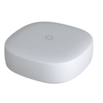
      </td>
      <td colspan="2">
         Used to control lights / fan in bedroom via night stand or on the wall. Utilized via the Zigbee network through Home Assistant.
      </td>
   </tr>
   
   <tr>
      <td align=center>
         <a href="https://amzn.to/2M1ALyQ">Philips Hue Motion Sensors</a>
      </td>
      <td align=center>
         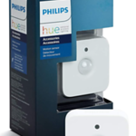
      </td>
      <td colspan="2">
         Alerts for motion when not home, or other automations for movement / motion / occupancy. Utilized via the Zigbee network in Home Assistant.
      </td>
   </tr>

</table>

<!----------------- NEW SECTION ------------------>
### <a name="ZWave">Z-Wave</a>

> [Back To Top](#SmartHomeEquipment)

<table border="0">
 
   <tr>
      <th align=center colspan="2">
         Device
      </th>
      <th align=center>
         Notes
      </th>
   </tr>

   <tr>
      <td align=center>
         <a href="https://amzn.to/3syKk9y">Schlage Touchscreen Deadbolt</a>
      </td>
      <td align=center>
         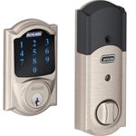
      </td>
      <td colspan="2">
         Lock for doors using the Z-Wave connection with Home Assistant.
      </td>
   </tr>
   
   <tr>
      <td align=center>
         <a href="https://amzn.to/38QF7lx">Leviton Decora Smart Dimmer</a>
      </td>
      <td align=center>
         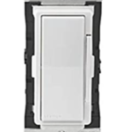
      </td>
      <td colspan="2">
         Light switch dimmers used via the Z-Wave network through Home Assistant. Places where Hue bulbs didn't make sense.
      </td>
   </tr>
 
</table>

<!----------------- NEW SECTION ------------------>
### <a name="Lighting">Lighting</a>

> [Back To Top](#SmartHomeEquipment)

<table border="0">
 
   <tr>
      <th align=center colspan="2">
         Device
      </th>
      <th align=center>
         Notes
      </th>
   </tr>

   <tr>
      <td align=center>
         <a href="https://amzn.to/3bIg06l">Hue Bulbs</a>
      </td>
      <td align=center>
         
      </td>
      <td colspan="2">
         Lightbulbs used in the Zigbee network through Home Assistant.
      </td>
   </tr>
 
</table>

<!----------------- NEW SECTION ------------------>
### <a name="Cameras">Cameras / Security / Motion Sensors</a>

> [Back To Top](#SmartHomeEquipment)

<table border="0">
 
   <tr>
      <th align=center colspan="2">
         Device
      </th>
      <th align=center>
         Notes
      </th>
   </tr>

   <tr>
      <td align=center>
         <a href="https://amzn.to/3syKk9y">Schlage Touchscreen Deadbolt</a>
      </td>
      <td align=center>
         
      </td>
      <td colspan="2">
         Lock for doors using the Z-Wave connection with Home Assistant.
      </td>
   </tr>
   
   <tr>
      <td align=center>
         <a href="https://amzn.to/35Onqkz">Unifi G3 Flex</a> (Camera)
      </td>
      <td align=center>
         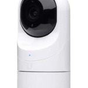
      </td>
      <td colspan="2">
         Cameras mounted around the house using the Unifi Protect software. Sensors connected to Home Assistant via the Unifi Protect integraton.
      </td>
   </tr>

   <tr>
      <td align=center>
         <a href="https://amzn.to/2NdK4fZ">Unifi G3 Bullet</a> (Camera)
      </td>
      <td align=center>
         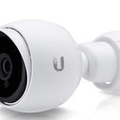
      </td>
      <td colspan="2">
         Cameras mounted around the house using the Unifi Protect software. Sensors connected to Home Assistant via the Unifi Protect integraton.
      </td>
   </tr>

   <tr>
      <td align=center>
         <a href="https://amzn.to/35MHOmk">Unifi G4 Doorbell</a> (Camera / Doorbell)
      </td>
      <td align=center>
         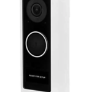
      </td>
      <td colspan="2">
         Provides live view for front door and alerts for doorbell ringing. Using the Unifi Protect software. Sensors connected to Home Assistant via the Unifi Protect integraton.
      </td>
   </tr>

   <tr>
      <td align=center>
         <a href="https://www.samsung.com/us/smart-home/smartthings/sensors/samsung-smartthings-motion-sensor-2018-gp-u999sjvlbaa/">Smart Things Motion Sensors</a>
      </td>
      <td align=center>
         
      </td>
      <td colspan="2">
         Alerts for motion when not home, or other automations for movement / motion / occupancy. Connected through Zigbee network in Home Assistant.
      </td>
   </tr>

   <tr>
      <td align=center>
         <a href="https://amzn.to/2M1ALyQ">Philips Hue Motion Sensors</a>
      </td>
      <td align=center>
         
      </td>
      <td colspan="2">
         Alerts for motion when not home, or other automations for movement / motion / occupancy. Connected through Zigbee network in Home Assistant.
      </td>
   </tr>
 
</table>

<!----------------- NEW SECTION ------------------>
### <a name="MediaDevices">Media Devices</a>

> [Back To Top](#SmartHomeEquipment)

<table border="0">
 
   <tr>
      <th align=center colspan="2">
         Device
      </th>
      <th align=center>
         Notes
      </th>
   </tr>

   <tr>
      <td align=center>
         <a href="https://amzn.to/3ZSoH5z">Fire TV 4K Sticks</a>
      </td>
      <td align=center>
         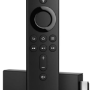
      </td>
      <td colspan="2">
         Main source of entertainment. Somewhat integration with Home Assistant.
      </td>
   </tr>
   
   <tr>
      <td align=center>
         <a href="https://amzn.to/2LS9WNH">Nvidia Shield TV</a>
      </td>
      <td align=center>
         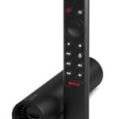
      </td>
      <td colspan="2">
         Main source of movie viewing in Movie Room
      </td>
   </tr>

   <tr>
      <td align=center>
         <a href="https://store.google.com/us/product/chromecast">Google Chromecast</a>
      </td>
      <td align=center>
         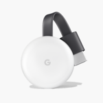
      </td>
      <td colspan="2">
         One or two around if needed, not used with Home Assistant at all.
      </td>
   </tr>
 
</table>

<!----------------- NEW SECTION ------------------>
### <a name="AmazonAlexa">Amazon Alexa</a>

> [Back To Top](#SmartHomeEquipment)

<table border="0">
   <tr>
      <th align=center colspan="2">
         Device
      </th>
      <th align=center>
         Notes
      </th>
   </tr>

   <tr>
      <td align=center>
         <a href="https://amzn.to/39TNSe7">Amazon Echo Show 15"</a>
      </td>
      <td align=center>
         
      </td>
      <td colspan="2">
         Kitchen standard use for timers, also use for showing cameras from Scrypted and other alerts
      </td>
   </tr>

   <tr>
      <td align=center>
         <a href="https://amzn.to/39TNSe7">Amazon Echo Dots</a>
      </td>
      <td align=center>
         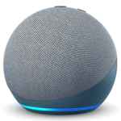
      </td>
      <td colspan="2">
         Standard use around the house
      </td>
   </tr>
   
   <tr>
      <td align=center>
         <a href="https://en.wikipedia.org/wiki/Amazon_Echo">Amazon Echo (Original)</a>
      </td>
      <td align=center>
         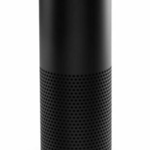
      </td>
      <td colspan="2">
         Standard use around the house
      </td>
   </tr>

   <tr>
      <td align=center>
         <a href="https://amzn.to/38SxjQ4">Amazon Echo Show 5"</a>
      </td>
      <td align=center>
         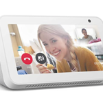
      </td>
      <td colspan="2">
         Standard use around the house
      </td>
   </tr>
</table>

<!----------------- NEW SECTION ------------------>
### <a name="Misc">Miscellaneous</a>

> [Back To Top](#SmartHomeEquipment)

<table border="0">
 
   <tr>
      <th align=center colspan="2">
         Device
      </th>
      <th align=center>
         Notes
      </th>
   </tr>

   <tr>
      <td align=center>
         <a href="https://amzn.to/2KmX2XH">Broadlink RM4 Mini</a>
      </td>
      <td align=center>
         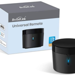
      </td>
      <td colspan="2">
         Provides IR in the living room mainly for turning on/off the Fireplace. These can also be used to control ANY IR device
      </td>
   </tr>

   <tr>
      <td align=center>
         <a href="https://www.samsung.com/us/business/home-appliances/washers/front-load/wf6500-4-5-cu-ft-addwash-front-load-washer-white-wf45k6500aw-a2/">Samsung Washer</a>
      </td>
      <td align=center>
         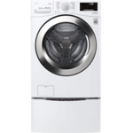
      </td>
      <td colspan="2">
         Standard Washer in the basement, used via the SmartThings skill
      </td>
   </tr>

   <tr>
      <td align=center>
         <a href="https://www.samsung.com/us/business/builder/our-appliances/dryers/electric/dv50k7500-7-5-cu-ft-capacity-electric-dryer-white-dv50k7500ew-a3/">Samsung Dryer</a>
      </td>
      <td align=center>
         
      </td>
      <td colspan="2">
         Standard Dryer in the basement, used via the SmartThings skill
      </td>
   </tr>

   <tr>
      <td align=center>
         <a href="https://www.mitsubishicomfort.com/products/">Mitsubishi Mini Split Units</a>
      </td>
      <td align=center>
         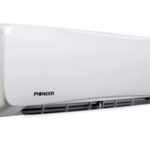
      </td>
      <td colspan="2">
         Providing Heat/AC to three seperate areas in the house
      </td>
   </tr>
</table>

<!----------------- NEW SECTION ------------------>